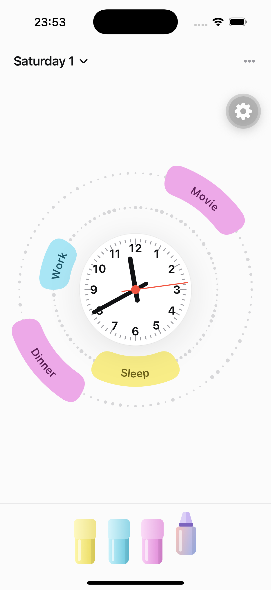
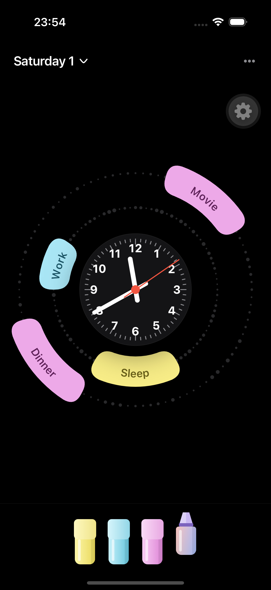
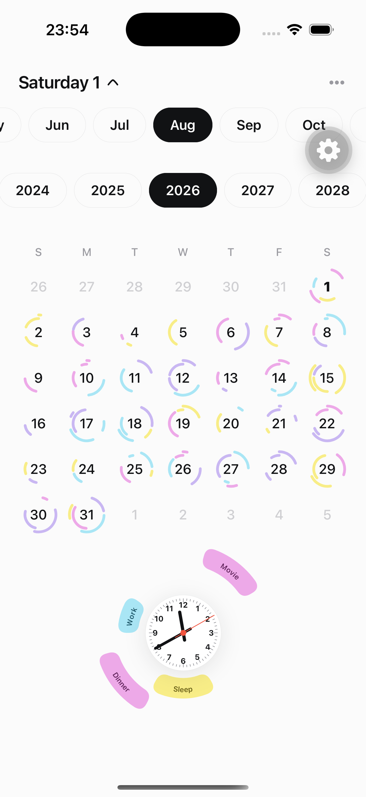
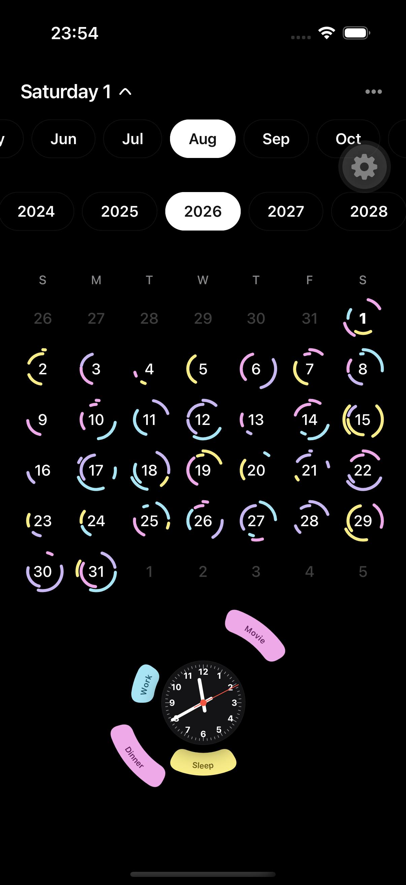
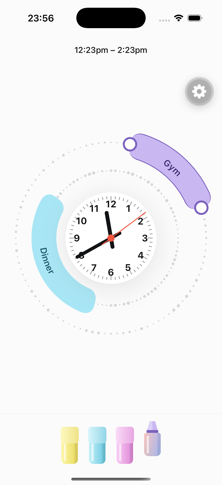
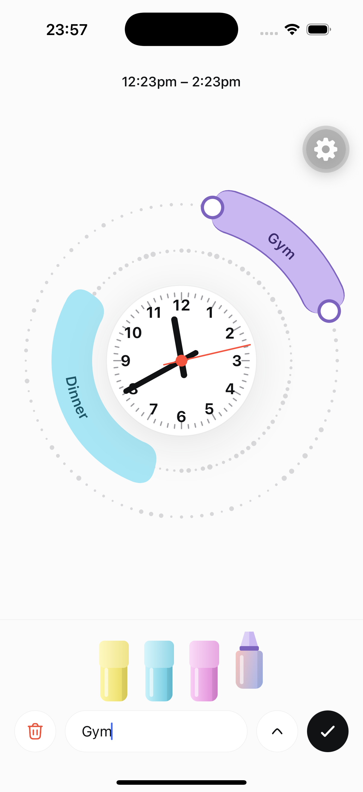

# Clockday

A day planner where a live analog clock is the canvas. You paint time ranges
onto dotted tracks around the face with highlighter markers, name them, and
colour them. Expanding the date header reveals a month calendar where every day
wears a miniature ring of its own arcs.

Inspired by [this post in r/vibecoding][inspiration] — a watch/Wear OS take on
planning a day directly on the clock face.

[inspiration]: https://www.reddit.com/r/vibecoding/comments/1vbe26r/you_asked_for_a_watchwear_os_version_of_my_lazy/

<table>
  <tr>
    <td align="center"></td>
    <td align="center"></td>
    <td align="center"></td>
    <td align="center"></td>
  </tr>
  <tr>
    <td align="center">The dial</td>
    <td align="center">…in dark</td>
    <td align="center">The month</td>
    <td align="center">…in dark</td>
  </tr>
</table>

## The idea

A 12-hour dial can't show a 24-hour day, so there are **two concentric dotted
tracks**: the inner one is AM (00:00–11:59), the outer is PM (12:00–23:59).
Dragging clockwise past 12 rolls the range from one track onto the next, so a
range like 11am–1pm draws as two arcs and the drag handle visibly hops rings.

Everything reduces to *minute-of-day, 0…1439* (`src/time.ts`). `segmentsFor()`
in `src/geometry.ts` cuts a range at every 12-hour boundary and is the single
source of arc geometry — used by the big dial and the calendar mini-rings alike.

## Editing a range

Drawing on empty track creates a range. After that, **one tap selects and two
taps name** — the common edit is nudging a time or swapping a colour, and
neither of those wants a keyboard in the way.

<table>
  <tr>
    <td align="center"></td>
    <td align="center"></td>
  </tr>
  <tr>
    <td align="center"><b>One tap</b><br>handles out, pens live, header<br>shows the range. No keyboard.</td>
    <td align="center"><b>Two taps</b><br>the name opens, with delete<br>and confirm either side.</td>
  </tr>
</table>

Telling those two apart is harder than it looks. The AM track runs at roughly a
pixel per minute while a handle's grab radius is 26px, so on a short range
*every point of the arc* is within grabbing distance of an end — commit to a
resize on touch-down and the second tap is never observable. So a press on a
handle stays undecided (`MAYBE_RESIZE`) and is settled by movement rather than
by time: travel `TAP_SLOP` and it becomes a resize, lift without travelling and
it was a tap.

## Running it

```sh
nvm use              # .nvmrc pins 20.19.5; RN 0.86 requires >= 20.19.4
npm install          # postinstall applies patches/ (see Gotchas)
npm run ios          # first run builds natively; Metro on port 8082
```

## Gotchas on this machine

- **Xcode.** Expo SDK 57 / RN 0.86 needs Swift 6.2 (Xcode 26+). `xcode-select`
  here points at Xcode 16.4 (Swift 6.1), which fails with
  `package 'apple' is using Swift tools version 6.2.0`. Either
  `sudo xcode-select -s /Applications/Xcode.app` once, or prefix builds:

  ```sh
  DEVELOPER_DIR=/Applications/Xcode.app/Contents/Developer npm run ios
  ```

- **`patches/expo-modules-jsi+57.0.4.patch`.** `expo-modules-jsi@57.0.4` (the
  latest release) does not compile under Xcode 26.3's Swift 6.2.4 —
  `abs(milliseconds) <= maxJavaScriptDateMilliseconds` is reported as
  "type of expression is ambiguous". The patch hoists it into an explicitly
  typed local. `patch-package` reapplies it on every install. Drop the patch
  once upstream fixes it.

## Layout

```
src/
  time.ts             minute-of-day math, angle<->time, formatting (worklets)
  geometry.ts         arc paths, range segmentation, hit-testing (worklets)
  constants.ts        radii derived from screen width, marker palette, motion
  theme.ts            light/dark tokens
  clock/              the single Skia canvas: face, hands, tracks, arcs, draft
  ui/                 header, label bar, marker pens, calendar
  store/              reducer + seeded mock month
  screens/            layout and the one Pan gesture that drives everything
```

Two rendering rules worth knowing before editing:

- **One canvas.** The whole dial is a single `<Canvas>` driven by shared values,
  so a drag or a ticking second hand never re-renders React. The calendar's 42
  day-rings are likewise one canvas, not 42.
- **One gesture.** `clockday-screen.tsx` has a single `Gesture.Pan()` that
  resolves handle / arc / empty-track in `onBegin` and acts only in
  `onFinalize`. Stacking a handler per arc is what makes pans phantom-fire —
  which is also why the tap/resize split above is a mode inside that one pan
  rather than a second recogniser composed around it.

Curved labels use Skia's `<TextPath>` with `matchFont` — a system typeface, so
there is no font asset to bundle. Glyphs stand perpendicular to the direction of
travel, so arcs in the lower half of the dial draw their label path reversed
(`needsReverse()`), otherwise the text reads upside down.

## State

In-memory only. The month is seeded from a deterministic PRNG so the calendar
looks populated and stable, and the current day is seeded with the reference
design's ranges. Everything resets on reload — there is no persistence layer.
